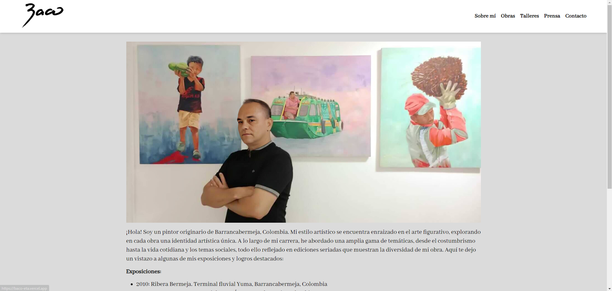

# Página web del Artista Oscar Bautista Cobos.

Bienvenido a la página web oficial del artista BACO! Este repositorio contiene el código fuente y los archivos necesarios para desplegar la página web del artista.

## Características de la Página Web

- **Sobre mí**: Descubre más sobre la vida y obra del artista, incluyendo su biografía, inspiraciones y filosofía artística.
- **Obras**: Explora una selección de las obras más destacadas de BACO, con galerías de imágenes y descripciones detalladas de cada pieza.
- **Talleres**: Mantente informado sobre los próximos talleres y clases, así como la información relevante sobre inscripciones y fechas.
- **Prensa**: Accede a artículos, entrevistas y reseñas que han sido publicadas sobre el trabajo de BACO, proporcionando una visión más amplia de su impacto en la comunidad artística.
- **Contacto**: ¿Interesado en adquirir una obra, programar una exhibición, o simplemente saludar a BACO? Encuentra aquí cómo ponerte en contacto.

## Tecnologías Utilizadas

La página web del artista está construida utilizando las siguientes tecnologías:

- [Astro](https://astro.build/): Un framework moderno para la creación de sitios web estáticos y dinámicos.
- [Tailwind CSS](https://tailwindcss.com/): Un framework de CSS utilitario para diseñar rápidamente interfaces de usuario.
- [JavaScript](https://developer.mozilla.org/es/docs/Web/JavaScript): Se utilizó JavaScript para agregar interactividad y funcionalidades dinámicas a la página web del artista.

## Cómo Contribuir

¡Nos encantaría recibir contribuciones para mejorar la página web del artista! Si tienes alguna sugerencia de características nuevas, cambios en el diseño, corrección de errores, o cualquier otra mejora, no dudes en enviar una solicitud de extracción.

## Despliegue

Puedes desplegar esta página web en tu propio servidor o utilizar servicios de hosting como GitHub Pages, Netlify, o cualquier otro de tu preferencia.

## Autor

Este proyecto fue desarrollado por Samuel Bautista Alvarado.

---
¡Gracias por visitar la página web del artista BACO! Si tienes alguna pregunta o comentario, no dudes en ponerte en contacto con nosotros.
